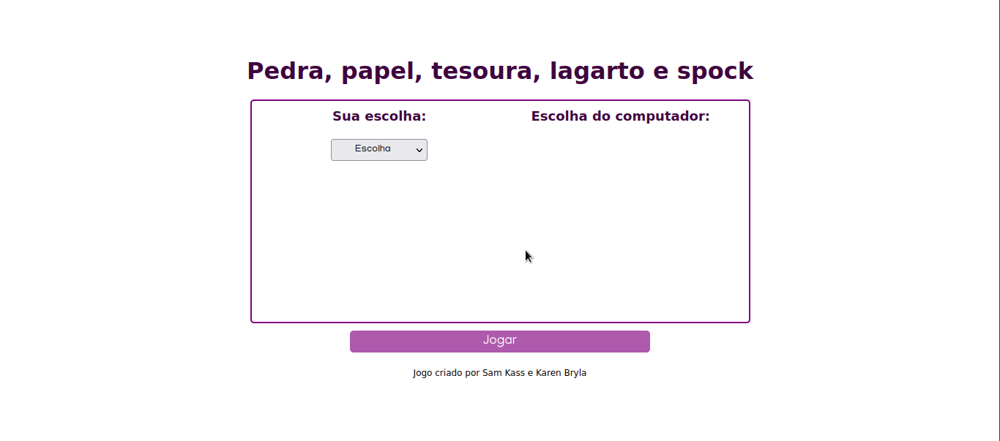
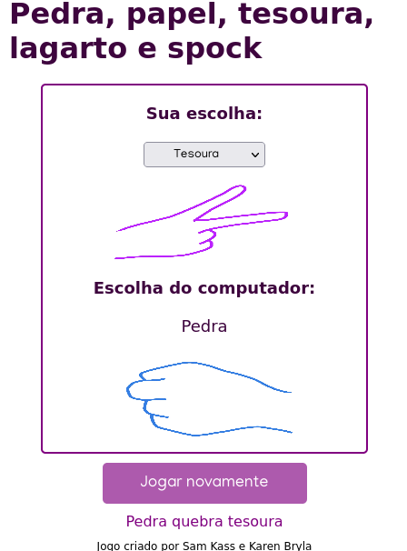
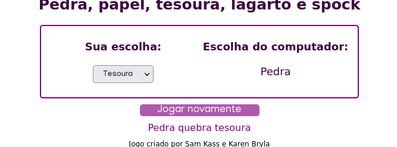

# Pedra, papel, tesoura, lagarto e Spock

## Descrição do projeto

 Pedra, papel, tesoura, lagarto e Spock é mais conhecido por ser jogado na série "The Big Bang Theory" pelo
  personagem Sheldon Cooper após notar que o tradicional pedra papel e tesoura é pouco eficiente quando jogado
  entre pessoas que se conhecem bem. 

  
 Então resolvi criar esse projeto com o intuito de praticar os fundamentos de JavaScript usando como base esse jogo.

  

##   
  
## Linguagens utilizadas
* HTML
* CSS
* JavaScript

## Imagens da página

